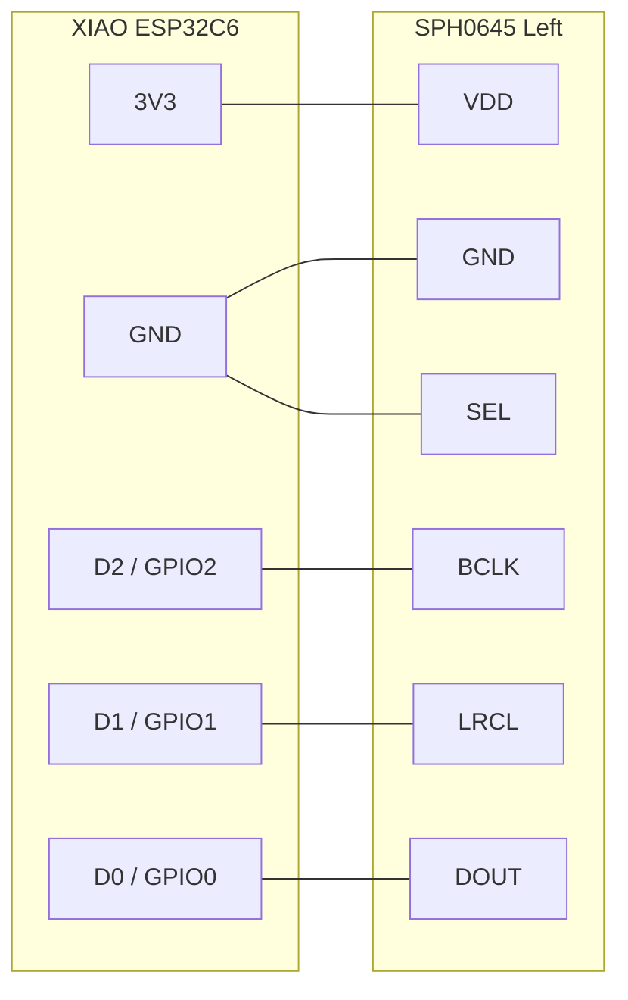
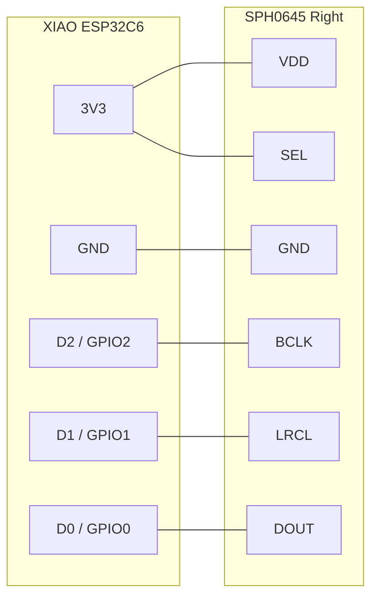
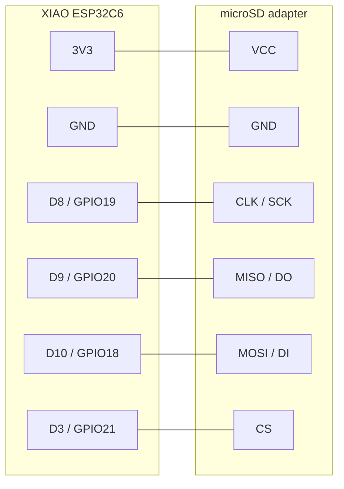
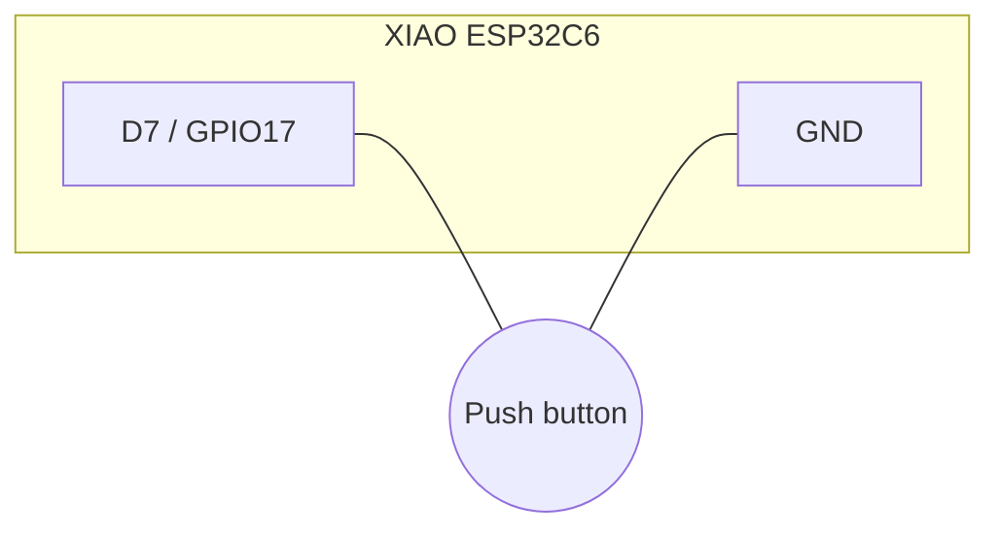

# Prawnd — Wiring

## Bill of materials
- 1× Seeed Studio XIAO ESP32C6
- 2× SPH0645LM4H I²S MEMS microphone breakout
- 1× 6-pin micro-SD SPI card adapter (3.3 V variant)
- 1× momentary push-button (any small tactile switch)
- 2× 100 nF ceramic capacitors (decoupling, one per mic)
- A short jumper wire from `3V3` to one mic's `SEL` and from `GND` to the other's `SEL`

## Pin map

| XIAO pin | GPIO | Direction | Connects to | Notes |
|---|---|---|---|---|
| `3V3` | — | PWR out | both mics' VDD, SD VCC, Mic-R SEL | 100 nF cap close to each mic's VDD. SD adapter must be 3.3 V. |
| `GND` | — | GND | every peripheral GND, button's other leg, Mic-L SEL | Star ground at the XIAO if layout allows. |
| `D2` | 2 | OUT | I²S BCLK → both mics' BCLK | Shared. |
| `D1` | 1 | OUT | I²S WS / LRCLK → both mics' LRCL | Shared. |
| `D0` | 0 | IN  | I²S DIN ← both mics' DOUT (tied together) | Shared DOUT line; the SEL pins tri-state each mic on the opposite slot. |
| `D8` | 19 | OUT | SD CLK (a.k.a. SCK) | Default SPI clock on the C6. |
| `D9` | 20 | IN  | SD MISO (a.k.a. DO) | Default SPI MISO. |
| `D10` | 18 | OUT | SD MOSI (a.k.a. DI) | Default SPI MOSI. |
| `D3` | 21 | OUT | SD CS | Software-controlled. |
| `D7` | 17 | IN  | Button (other leg → GND) | Firmware sets `INPUT_PULLUP`, active-low. |

### Mic SEL strapping (this picks left vs right)
- **Mic-L**: `SEL → GND` → drives the **left** (WS-low) I²S slot
- **Mic-R**: `SEL → 3V3` → drives the **right** (WS-high) I²S slot

## Diagrams (per device)

Wire one device at a time, verify with the bring-up sketches in the plan, then move to the next.

### SPH0645 — Left mic



```
SPH0645 (L)  VDD  --- 3V3      (XIAO 3V3 rail)
             GND  --- GND      (XIAO GND rail)
             BCLK --- D2       (GPIO2,  I2S BCLK)
             LRCL --- D1       (GPIO1,  I2S WS)
             DOUT --- D0       (GPIO0,  I2S DIN, shared with Mic-R)
             SEL  --- GND      (selects the LEFT slot)
```

### SPH0645 — Right mic



```
SPH0645 (R)  VDD  --- 3V3      (XIAO 3V3 rail)
             GND  --- GND      (XIAO GND rail)
             BCLK --- D2       (GPIO2,  I2S BCLK, shared with Mic-L)
             LRCL --- D1       (GPIO1,  I2S WS,   shared with Mic-L)
             DOUT --- D0       (GPIO0,  I2S DIN,  shared with Mic-L)
             SEL  --- 3V3      (selects the RIGHT slot)
```

### microSD adapter



```
microSD      VCC      --- 3V3      (3.3V variant adapter — confirm silkscreen)
             GND      --- GND
             CLK/SCK  --- D8       (GPIO19, SPI SCK)
             MISO/DO  --- D9       (GPIO20, SPI MISO)
             MOSI/DI  --- D10      (GPIO18, SPI MOSI)
             CS       --- D3       (GPIO21)
```

### Button



```
Push button  leg A    --- D7       (GPIO17, INPUT_PULLUP in firmware)
             leg B    --- GND
```

## XIAO ESP32C6 pinout reference

```
                    XIAO ESP32C6 (top-down)
                    +-----------------------+
              3V3 --|                       |-- GND
   I2S DIN    D0 --|  (USB-C at this edge) |-- D10  SD MOSI/DI
   I2S WS     D1 --|                       |-- D9   SD MISO/DO
   I2S BCLK   D2 --|                       |-- D8   SD CLK/SCK
   SD CS      D3 --|                       |-- D7   BUTTON
              D4 --|                       |-- D6
              D5 --|                       |
                    +-----------------------+
```

## Caveats

1. The SPH0645's DOUT is invalid for ~50 ms after BCLK starts. The firmware (`audio.cpp::audioDropSettle`) drops the first ~1600 samples so this doesn't end up in the WAV.
2. Both mics drive the **same** DOUT wire. This works because each mic tri-states its DOUT during the opposite slot, gated by the SEL pin. Do not substitute a non-tri-stating mic without revisiting the bus.
3. SPH0645 has a noticeable DC offset; tolerable for voice. Add a software high-pass at ~20 Hz later if you start visualising the waveform.
4. ESP32-C6 boot-strap pins are `GPIO8` and `GPIO9` — neither is used here.
5. The micro-SD card must be formatted **FAT32**. The Arduino `SD` library does not handle exFAT or large-block FAT16.
6. Empirical gain in `audio.cpp` is `4×` after the shift. Tune up or down at bring-up so normal speech peaks around −6 dBFS.

## Optional follow-up
A polished schematic (KiCad) or breadboard render (Fritzing) is nice-to-have but not required to build v1 — every connection is on this page.
